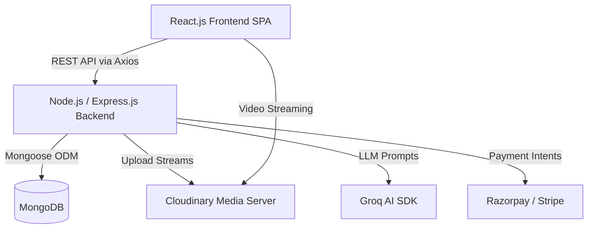

# Comprehensive Project Report: AI-Powered E-Learning Platform

This document serves as an exhaustive, detailed report on the AI-Powered E-Learning Platform. It outlines the project's vision, working architecture, exhaustive feature sets, database schema, and technical stack. This comprehensive guide can be utilized by developers, stakeholders, and presentation creators to understand every facet of the system.

---

## 1. Executive Summary

The AI-Powered E-Learning Platform is a state-of-the-art educational marketplace built on the MERN stack (MongoDB, Express.js, React.js, Node.js). It is designed to disrupt traditional e-learning by integrating an intelligent AI chatbot powered by Groq, providing a seamless and highly interactive environment. The platform offers dedicated portals for three distinct user roles—Learners, Instructors, and Administrators—ensuring a tailored experience ranging from course consumption and creation to global platform management. 

---

## 2. Project Vision & Objectives

**Vision:** To democratize education by providing a scalable, accessible, and intelligent learning ecosystem where instructors can easily monetize their knowledge, and learners receive personalized, 24/7 AI-driven assistance.

**Key Objectives:**
- Deliver a premium, distraction-free User Interface (UI).
- Reduce learner friction with instant AI-powered doubt resolution.
- Provide a robust CMS for instructors to manage courses and media securely.
- Ensure transparent financial transactions through integrated payment gateways (Razorpay/Stripe).
- Maintain complete platform oversight through a powerful administrative dashboard.

---

## 3. Comprehensive Feature Breakdown

### A. Learner Ecosystem
- **Authentication & Profiles:** Secure JWT-based login/signup, password reset functionality, and customizable user profiles with avatar uploads.
- **Course Discovery & Search:** Dynamic filtering by category, price, and instructor, accompanied by rich course overview pages.
- **Immersive Learning Environment:** A dedicated `CourseContent` view supporting rich text, embedded videos, and interactive elements.
- **AI Chatbot Assistant:** A persistently available widget powered by the Groq SDK, trained to answer queries specifically related to course material.
- **E-Commerce Flow:** Shopping cart functionality with integrated Razorpay checkout for seamless course enrollment.
- **Progress Tracking:** Visual indicators of completed modules and overall course completion percentages.
- **Discussions:** Built-in community discussion boards for peer-to-peer learning.

### B. Instructor Workspace
- **Course Management System (CMS):** A comprehensive suite to draft, publish, and structure courses into modules and discrete lessons.
- **Seamless Media Management:** Integration with Cloudinary via Multer for optimized uploading and streaming of video lectures and course thumbnails.
- **Student Analytics:** Dashboards tracking the number of enrolled students, active learners, and completion rates.
- **Financial Dashboard:** Real-time metrics showing total sales, platform fee deductions, and net instructor earnings.
- **Instructor Profile Management:** Tools to highlight instructor credentials, biography, and social links.

### C. Administrator Control Center
- **Global Overview Dashboard:** High-level metrics showing total registered users, total platform revenue, and active courses.
- **User Moderation:** Tools to suspend, delete, or manage Learner and Instructor accounts.
- **Financial Auditing:** Detailed oversight of all transactions, calculating the platform's cut versus instructor payouts.
- **Activity Logging & Notifications:** System-wide audit trails (`ActivityLog`) for sensitive actions and broadcast notifications to users.
- **Platform Configuration:** Global settings to manage categories, commission rates, and site-wide banners.

---

## 4. Working Architecture & Data Flow

The platform utilizes a traditional Client-Server RESTful architecture. 

### High-Level System Architecture

### Request Lifecycle Example (Course Purchase)
1. **Client Action:** Learner adds a course to the Cart and clicks "Checkout".
2. **Backend API:** React sends a POST request to `/api/cart/checkout`.
3. **Payment Gateway Initiation:** Node.js server communicates with Razorpay to generate an Order ID.
4. **Client Payment:** Learner completes the transaction via the Razorpay UI widget on the frontend.
5. **Webhook/Verification:** Razorpay sends a success payload. The backend verifies the signature using `crypto`.
6. **Database Update:** The `User` document is updated to include the newly purchased course. An `ActivityLog` and `Notification` are generated.
7. **Client Feedback:** Learner is redirected to the Dashboard with a success toast notification.

---

## 5. Technical Stack Details

### Frontend (Client-Side)
- **Core:** React.js (v19) with React Router v7.
- **Styling:** Custom CSS architectures combined with Tailwind principles, ensuring a responsive, glassmorphism aesthetic.
- **Animations & Visualization:** Framer Motion for micro-interactions; Recharts for financial and analytical data rendering.
- **Utilities:** `axios` for HTTP requests, `react-hot-toast` for notifications, `react-markdown` for rendering rich text.

### Backend (Server-Side)
- **Core:** Node.js with Express.js routing.
- **Database:** MongoDB hosted on MongoDB Atlas, interfaced via Mongoose ODM.
- **Security:** `bcryptjs` for password hashing, `cors` for cross-origin resource sharing, and JWT (assumed based on structure) for stateless authentication.
- **File Handling:** `multer` and `multer-storage-cloudinary` for processing multipart/form-data.

### External APIs & Integrations
- **Groq SDK:** Powers the LLM-based intelligent chatbot.
- **Cloudinary:** Acts as the CDN and storage solution for all static assets and heavy video files.
- **Razorpay/Stripe:** Handles PCI-compliant payment processing.
- **PDF Parse / jsPDF:** Utilities for generating certificates and parsing uploaded documents.

---

## 6. Database Schema & Models Overview

The application utilizes a relational-like structure within a NoSQL environment using Mongoose `ObjectIds`. Key collections include:

- **User / Admin / Instructor:** Separate models storing credentials, profile data, and roles. `User` contains an array of enrolled course IDs.
- **Course:** Stores metadata (title, description, price), Cloudinary media links, and an array of nested Module/Lesson objects.
- **Discussion:** Tied to specific courses and users, enabling a threaded Q&A forum.
- **ActivityLog:** Records administrative actions and critical system events for auditing.
- **Notification:** System-wide or targeted alerts for users (e.g., "New Course Published").
- **Contact:** Stores inquiries submitted via the platform's public contact form.

---

## 7. Security & Performance Optimization

**Security measures include:**
- Environment variable protection (`.env`) for all API keys and database URIs.
- Password hashing utilizing high salt rounds via Bcrypt.
- Role-Based Access Control (RBAC) ensuring learners cannot access instructor routes, and instructors cannot access admin routes.
- Webhook signature verification to prevent fraudulent payment confirmations.

**Performance optimizations include:**
- **Media Offloading:** Utilizing Cloudinary ensures the Node.js server is not bottlenecked by serving large video files.
- **SPA Architecture:** React Router prevents full page reloads, ensuring a snappy user experience.
- **NoSQL Flexibility:** MongoDB allows for rapid querying of deeply nested course structures without complex SQL joins.

---

## 8. Deployment & DevOps Strategy

- **Frontend Hosting:** Designed to be deployed on Vercel or Netlify, leveraging their edge caching for fast global load times.
- **Backend Hosting:** Suitable for deployment on platforms like Render, Heroku, or AWS EC2.
- **Database:** MongoDB Atlas serverless clusters ensuring high availability and automatic scaling.
- **CI/CD:** Capable of integrating with GitHub Actions for automated testing and deployment pipelines upon pushing to the `main` branch.

---

## 9. Future Enhancements / Roadmap

- **Live Streaming integration:** Allowing instructors to host live masterclasses.
- **Gamification:** Implementing badges, leaderboards, and certificates upon course completion.
- **Advanced AI Analytics:** Predictive algorithms to suggest courses based on a learner's browsing history and past performance.
- **Mobile Application:** Porting the React frontend to React Native for iOS and Android deployment.

---

## 10. Slide-by-Slide Presentation Guide

If utilizing this document for a pitch deck or internal presentation, follow this structure:

- **Slide 1:** Title, Vision, and Platform Overview.
- **Slide 2:** The Problem in modern e-learning & Our Solution.
- **Slide 3:** Learner Portal Highlights (AI Chatbot, UI/UX, Checkout).
- **Slide 4:** Instructor Workspace Highlights (CMS, Cloudinary Media, Revenue).
- **Slide 5:** Admin & Security Overview (Global oversight, RBAC).
- **Slide 6:** Working Architecture (Include the Mermaid Flowchart).
- **Slide 7:** Technical Stack & Integrations (MERN + Groq + Cloudinary + Razorpay).
- **Slide 8:** Database Architecture (Overview of Mongoose Models).
- **Slide 9:** Roadmap & Future Enhancements.
- **Slide 10:** Conclusion & Q&A.
